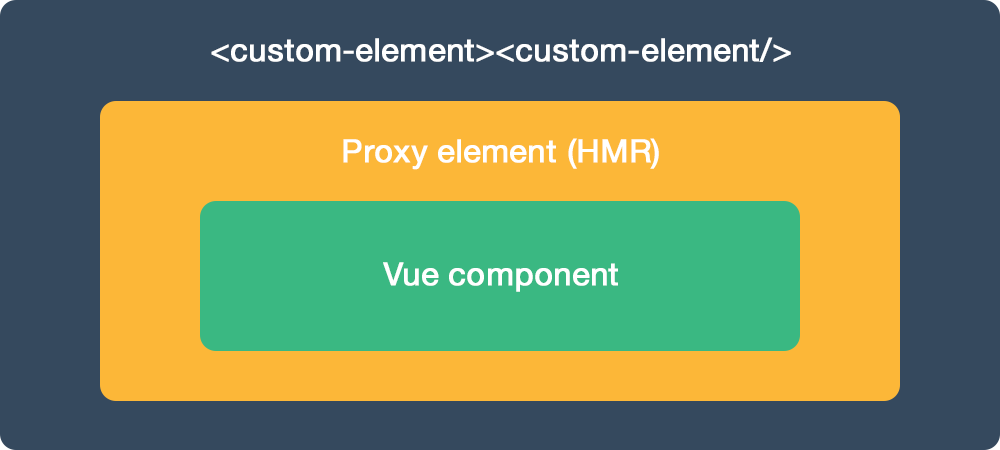

## Table of content

- [Demo](#demo)
- [Installation](#installation)
- [Description](#description)
- [Example](#example)
- [Browsers support](#browsers-support)
- [Options](#options)
- [How does it work?](#how-does-it-work)
- [Testing](#testing)
- [Caveats](#caveats)

## Demo
You can check Vue-custom-element demos at **https://karol-f.github.io/vue-custom-element/**

## Installation

#### NPM
```bash
npm install vue-custom-element --save
```

```javascript
import vueCustomElement from 'vue-custom-element'

Vue.use(vueCustomElement);
```

#### Direct include

If you are using Vue globally, just include `vue-custom-element.js` and it will automatically install the `Vue.customElement` method.

```html
<script src="path/to/vue-custom-element.js"></script>
```

#### Optional polyfill
For cross-browser compatibility (IE9+) use Custom Elements polyfill.

```html
<script src="https://cdnjs.cloudflare.com/ajax/libs/document-register-element/1.4.1/document-register-element.js"></script>
```

or 

```
import 'document-register-element/build/document-register-element';
```

## Description

`Vue-custom-element` is a tiny wrapper around Vue components. It provide seamless way to use it in HTML, plain JavaScript, Vue, React, Angular etc., using power of Custom Elements.
* Works with Vue 0.12.x, 1.x and 2.x
* Small - 2.5 kb min+gzip, optional polyfill - 5 kb min+gzip

### Why you might need `Vue-custom-element`?


It might be confusing for users to understand difference between Vue components, Custom Elements and it's use cases.
 
Why you might need `Vue-custom-element`? Simply, for your Vue components user's convinience. All they would need to do is include your JavaScript file and then they can:

* include HTML tag (e.g. `<my-component><my-component />`) in any time of document lifecycle. You can use your elements in e.g. SPA application just by including HTML tag - no Vue initialization or JavaScript usage is needed. Custom Elements will auto initialize when mounted into document. You can include them in e.g. Vue, Angular or React projects and browser will take care of detecting it and initialization
* use simple API that allows for interacting with underlaying Vue instance by changing attributes, props or listening to events
* take advantage of features like lazy-loading, that allows for loading components on demand, only when user add them to document

### Features

* **Simplicity** - only `tag-name` and Vue component `object` is needed for `Vue.customElement()` usage
* **Compatibility** - using optional polyfill we can support wide range of browsers, including IE9+, Android and IOS
* **Full featured** - you can use nesting, HMR, slots, lazy-loading, native Custom Elements callbacks.
	* reactive props and HTML attributes
	* automatic props casting (numbers, booleans) so they won't be available as strings but proper data types
	* listening to Vue component $emit'ed events
	* 'default' and 'named' slots are available for passing static content, check demo for example
	* Hot Module Replacement for seamless developer experience (unminimized build, Vue 2.x+)
	* lazy-loading - you can download component after it's attached to document. Useful for e.g. UI library authors. Check demo for example
	* detecting if detached callback is not invoked due to opening vue-custom-element in modal - element is then detached and attached to DOM again. It would be undesirable to destroy it immediately
* **Custom Elements v1** - compatible with latest specification. Vue-custom-element will use native implementation if supported

Check demos site to see it in action. 

## Example
For additional examples and detailed description check the demos page.

###### Custom Element HTML
``` html
<widget-vue prop1="1" prop2="string" prop3="true"></widget-vue>
```

###### JavaScript - register with Vue-custom-element
``` js
Vue.customElement('widget-vue', {
  props: [
    'prop1',
    'prop2',
    'prop3'
  ],
  data: {
    message: 'Hello Vue!'
  },
  template: '<p>{{ message }}, {{ prop1  }}, {{prop2}}, {{prop3}}</p>'
});
```

###### JavaScript - element API usage
``` js
document.querySelector('widget-vue')[0].prop2 // get prop value
document.querySelector('widget-vue')[0].prop2 = 'another string' // set prop value
```

You can also change `<widget-vue>` HTML attributes and changes will be instantly reflected.


## Browsers support

| [](http://godban.github.io/browsers-support-badges/)</br>Firefox | [](http://godban.github.io/browsers-support-badges/)</br>Chrome | [](http://godban.github.io/browsers-support-badges/)</br>Safari | [](http://godban.github.io/browsers-support-badges/)</br>Opera | [](http://godban.github.io/browsers-support-badges/)</br>Android |
|:---------:|:---------:|:---------:|:---------:|:---------:|
| behind --flag| 54+ | 10.1+ | 42+| 55+

[Custom Elements v1 support](http://caniuse.com/#feat=custom-elementsv1)

#### With optional polyfill

| [](http://godban.github.io/browsers-support-badges/)</br>IE / Edge | [](http://godban.github.io/browsers-support-badges/)</br>Firefox | [](http://godban.github.io/browsers-support-badges/)</br>Chrome | [](http://godban.github.io/browsers-support-badges/)</br>Safari | [](http://godban.github.io/browsers-support-badges/)</br>Opera | [](http://godban.github.io/browsers-support-badges/)</br>iOS | [](http://godban.github.io/browsers-support-badges/)</br>Android |
|:---------:|:---------:|:---------:|:---------:|:---------:|:---------:|:---------:|
| IE9+, Edge| &check;| &check; | &check; | &check; | &check; | &check;

## Options
Additional, optional, third parameter to `Vue.customElement()` is options object. You can pass following methods.

'This' in callbacks points to Custom Element's DOM Node.

```javascript
{
  // 'constructorCallback' can be triggered multiple times when e.g. vue-router is used
  constructorCallback() {
      console.info('constructorCallback', this);
  },

  // element is mounted/inserted into document
  connectedCallback() {
    console.info('connectedCallback', this);
  },

  // element is removed from document
  disconnectedCallback() {
    console.warn('disconnectedCallback', this);
  },

  // one of element's attributes (Vue instance props) is changed 
  attributeChangedCallback(name, oldValue, value) {
    console.info('attributeChangedCallback', name, oldValue, value);
  },
  
  // in case of using vue-custom-element with modals, we destroy  it after defined timeout
  destroyTimeout: 3000,
  
  // only needed when using lazy-loading - 'props' are not accessible on Custom Element registration so we have to provide them
  props: [],

  // you can set shadow root for element. Only works if native implementation is available.
  shadow: false,
  
  // you can set CSS that will be available in Shadow DOM.
  shadowCss: ''
}
```

Example options usage:

```javascript
import MyElement from './MyElement.vue';

Vue.customElement('my-element', MyElement, {
  shadow: true,
  shadowCss: `
  .card {
     background-color: blue;
  }`
});
```

Callbacks are executed before lifecycle hooks from Vue component passed to Vue-custom-element. It's better idea just to use Vue component lifecycle hooks (e.g. `created`, `mounted`, `beforeDestroy`).

## How does it work?


Inside HTML tag of defined custom element, Vue-custom-element will create:

* Proxy component for seamless Hot Module Replacement, using render function for performance (Vue 2.x+) 
* Vue component passed to Vue-custom-element

Custom Element HTML tag will expose API to interact with underlying Vue component - you can change HTML attributes or props, using JavaScript. 

## Testing

For advanced access, when exposed API is not enough, defined custom element will expose Vue instance via `__vue_custom_element__` prop.

```javascript
console.info(document.querySelector('widget-vue').__vue_custom_element__)
```
## Caveats

* custom elements **must** contain a hyphen in its tag name. For example, `my-element` is valid, but `myelement` is not
* in dev mode Vue will display console warning about element not being registered. It's desirable behaviour as we want to use browser's Custom Elements registration. You can use https://vuejs.org/v2/api/#ignoredElements to get rid of this warnings.

## Contribute

#### Developement
```
npm install
npm run dev:demo
```

#### Release
```
npm run build
```
This command will compile `vue-custom-element.js` and docs files.

Please take a note that `npm run build` will use `config.build.assetsPublicPath`, which is set to Github Pages path in `config/index.js`.

## License

[MIT](http://opensource.org/licenses/MIT)
