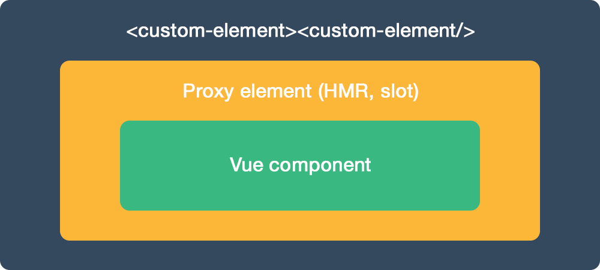

## Demo
You can test Vue-element demo at https://karol-f.github.io/vue-element/

## Install

####NPM
```bash
npm install vue-element --save
```

```javascript
import vueElement from 'vue-element'

Vue.use(vueElement);
```

#### Direct include

If you are using Vue globally, just include `vue-element.js` and it will automatically install the `Vue.element` method.

```html
<script src="path/to/vue-element.js"></script>
```
####Optional polyfill
For cross-browser compatibility use Custom Elements polyfill.

```html
<script src="https://cdnjs.cloudflare.com/ajax/libs/document-register-element/1.3.0/document-register-element.js"></script>
```

## Description

Take your Vue components to the next level using Custom Elements.

* Work with Vue 0.12.x, 1.x and 2.x
* Small - 2.5 kb min+gzip + optional polyfill - 5,1 kb min+gzip

## Example
Usage is the same as `Vue.component()` - you pass in exactly the same options as if you are defining a Vue component. 

For additional examples and detailed description check the demo page.

###### Custom Element HTML
``` html
<widget-vue prop1="1" prop2="string" prop3="true"></widget-vue>
```

###### JavaScript - register with Vue-element
``` js
Vue.element('widget-vue', {
  props: [
    'prop1',
    'prop2',
    'prop3'
  ],
  data: {
    message: 'Hello Vue!'
  },
  template: '<p>{{ message }}, {{ prop1  }}, {{prop2}}, {{prop3}}</p>'
});
```

###### JavaScript - element API usage
``` js
document.querySelector('widget-vue').prop2 // get prop value
document.querySelector('widget-vue').prop2 = 'another string' // set prop value
```

You can also change `<widget-vue>` HTML attributes and changes will be instantly reflected.


## Browsers support

| [](http://godban.github.io/browsers-support-badges/)</br>Firefox | [](http://godban.github.io/browsers-support-badges/)</br>Chrome | [](http://godban.github.io/browsers-support-badges/)</br>Safari | [](http://godban.github.io/browsers-support-badges/)</br>Opera | [](http://godban.github.io/browsers-support-badges/)</br>Chrome for Android |
|:---------:|:---------:|:---------:|:---------:|:---------:|
| behind --flag| 54+ | Technology Preview| 42+| 55+

[Custom Elements v1 support](http://caniuse.com/#feat=custom-elementsv1)

#### With optional polyfill

| [](http://godban.github.io/browsers-support-badges/)</br>IE / Edge | [](http://godban.github.io/browsers-support-badges/)</br>Firefox | [](http://godban.github.io/browsers-support-badges/)</br>Chrome | [](http://godban.github.io/browsers-support-badges/)</br>Safari | [](http://godban.github.io/browsers-support-badges/)</br>Opera | [](http://godban.github.io/browsers-support-badges/)</br>iOS | [](http://godban.github.io/browsers-support-badges/)</br>Android |
|:---------:|:---------:|:---------:|:---------:|:---------:|:---------:|:---------:|
| IE9+, Edge| &check;| &check; | &check; | &check; | &check; | &check;

## Options

```javascript
{}
```

## How does it work?


Inside HTML tag of defined custom element, Vue-element will create:

* Proxy components for seamless Hot Module Replacement (only for Vue 2.x)
* Vue component passed to Vue-element

HTML tag of custom element will expose API to interact with underlying Vue component - you can change HTML attributes or props, using JavaScript. 

Check demos to check it in action.

## Testing

If you need advanced access, when exposed API is not enough, defined custom element will expose Vue instance via `__vue_element__` prop.

```javascript
console.info(document.querySelector('widget-vue').__vue_element__)
```

## License

[MIT](http://opensource.org/licenses/MIT)
