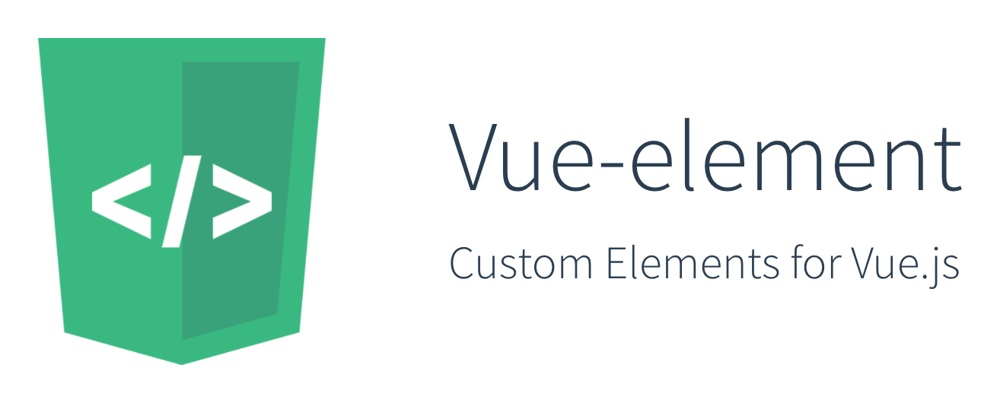

## Table of content

- [Demo](#demo)
- [Installation](#installation)
- [Description](#description)
- [Example](#example)
- [Browsers support](#browsers-support)
- [Options](#options)
- [How does it work?](#how-does-it-work)
- [Testing](#testing)
- [Caveats](#caveats)

## Demo
You can check Vue-element demos at https://karol-f.github.io/vue-element/

## Installation

####NPM
```bash
npm install vue-element --save
```

```javascript
import vueElement from 'vue-element'

Vue.use(vueElement);
```

#### Direct include

If you are using Vue globally, just include `vue-element.js` and it will automatically install the `Vue.element` method.

```html
<script src="path/to/vue-element.js"></script>
```
####Optional polyfill
For cross-browser compatibility (IE9+) use Custom Elements polyfill.

```html
<script src="https://cdnjs.cloudflare.com/ajax/libs/document-register-element/1.3.0/document-register-element.js"></script>
```

## Description

Take your Vue components, powered by Custom Elements, to the next level. Seamlessly use created elements in HTML, plain JavaScript, Vue, React, Angular etc.

* Works with Vue 0.12.x, 1.x and 2.x
* Small - 2.5 kb min+gzip, optional polyfill - 5,1 kb min+gzip

### Features

* **Simplicity** - only `tag-name` and Vue component `object` is needed for `Vue.element()` usage
* **Compatibility** - using optional polyfill we can support wide range of browsers, including IE9+, Android and IOS
* **Full featured** - you can use nesting, HMR, slots, lazy-loading, native Custom Elements callbacks.
	* reactive props and HTML attributes
	* automatic props casting (numbers, booleans) so they won't be available as strings but proper data types
	* 'default' and 'named' slots are available, check demo for example
	* Hot Module Replacement for seamless developer experience (Vue 2.x+)
	* lazy-loading - you can download component after it's attached to document. Useful for e.g. UI library authors. Check demo for example
	* detecting if detached callback is not invoked due to opening vue-element in modal - element is then detached and attached to DOM again. It would be undesirable to destroy it immediately
* **Custom Elements v1** - compatible with latest specification. Vue-element will use native implementation if supported

Check demos site to see it in action. 

## Example
For additional examples and detailed description check the demos page.

###### Custom Element HTML
``` html
<widget-vue prop1="1" prop2="string" prop3="true"></widget-vue>
```

###### JavaScript - register with Vue-element
``` js
Vue.element('widget-vue', {
  props: [
    'prop1',
    'prop2',
    'prop3'
  ],
  data: {
    message: 'Hello Vue!'
  },
  template: '<p>{{ message }}, {{ prop1  }}, {{prop2}}, {{prop3}}</p>'
});
```

###### JavaScript - element API usage
``` js
document.querySelector('widget-vue')[0].prop2 // get prop value
document.querySelector('widget-vue')[0].prop2 = 'another string' // set prop value
```

You can also change `<widget-vue>` HTML attributes and changes will be instantly reflected.


## Browsers support

| [](http://godban.github.io/browsers-support-badges/)</br>Firefox | [](http://godban.github.io/browsers-support-badges/)</br>Chrome | [](http://godban.github.io/browsers-support-badges/)</br>Safari | [](http://godban.github.io/browsers-support-badges/)</br>Opera | [](http://godban.github.io/browsers-support-badges/)</br>Android |
|:---------:|:---------:|:---------:|:---------:|:---------:|
| behind --flag| 54+ | Technology Preview| 42+| 55+

[Custom Elements v1 support](http://caniuse.com/#feat=custom-elementsv1)

#### With optional polyfill

| [](http://godban.github.io/browsers-support-badges/)</br>IE / Edge | [](http://godban.github.io/browsers-support-badges/)</br>Firefox | [](http://godban.github.io/browsers-support-badges/)</br>Chrome | [](http://godban.github.io/browsers-support-badges/)</br>Safari | [](http://godban.github.io/browsers-support-badges/)</br>Opera | [](http://godban.github.io/browsers-support-badges/)</br>iOS | [](http://godban.github.io/browsers-support-badges/)</br>Android |
|:---------:|:---------:|:---------:|:---------:|:---------:|:---------:|:---------:|
| IE9+, Edge| &check;| &check; | &check; | &check; | &check; | &check;

## Options
Additional, optional, third parameter to `Vue.element()` is options object. You can pass following methods.

'This' in callbacks points to Custom Element's DOM Node.

```javascript
{
  // 'constructorCallback' can be triggered multiple times when e.g. vue-router is used
  constructorCallback() {
      console.info('constructorCallback', this);
  },

  // element is mounted/inserted into document
  connectedCallback() {
    console.info('connectedCallback', this);
  },

  // element is removed from document
  disconnectedCallback() {
    console.warn('disconnectedCallback', this);
  },

  // one of element's attributes (Vue instance props) is changed 
  attributeChangedCallback(name, oldValue, value) {
    console.info('attributeChangedCallback', name, oldValue, value);
  },
  
  // only needed when using lazy-loading - when 'props' are not accessible on Custom Element registration
  props: [],

  // you can set shadow root for element. Only works if native implementation is available.
  shadow: false
}
```

Callbacks are executed before lifecycle hooks from Vue component passed to Vue-element. It's better idea just to use Vue component lifecycle hooks (e.g. `created`, `mounted`, `beforeDestroy`).

## How does it work?


Inside HTML tag of defined custom element, Vue-element will create:

* Proxy component for seamless Hot Module Replacement, using render function for great performance (Vue 2.x+) 
* Vue component passed to Vue-element

Custom Element HTML tag will expose API to interact with underlying Vue component - you can change HTML attributes or props, using JavaScript. 

## Testing

For advanced access, when exposed API is not enough, defined custom element will expose Vue instance via `__vue_element__` prop.

```javascript
console.info(document.querySelector('widget-vue').__vue_element__)
```
## Caveats

* custom elements **must** contain a hyphen in its tag name. For example, `my-element` is valid, but `myelement` is not
* in dev mode Vue will display console warning about element not being registered. It's desirable behaviour as we want to use browser's Custom Elements registration

## Contribute

```
npm install
npm run dev
```

## License

[MIT](http://opensource.org/licenses/MIT)
